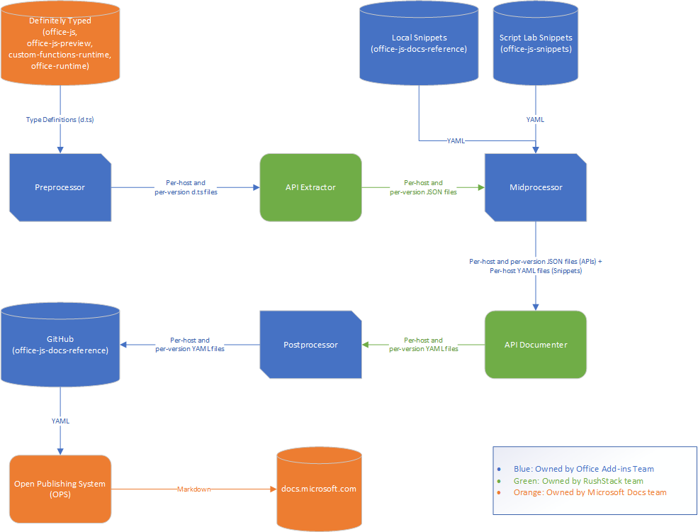

# How the Office JavaScript API documentation is generated

The Office JavaScript reference documentation pages are generated from type definition files and example snippets. This process uses a blend of open source tools and repository-specific scripts. This document aims to make the processes of this repository transparent so the community can better benefit from and contribute to this content.

## Content sources

Two types of content are combined to create the Office-JS reference documentation: type definitions and code snippets. These ensure complete API coverage and give small, inline code samples.

### Type definition files

The type definition files on [Definitely Typed](https://github.com/DefinitelyTyped/DefinitelyTyped) are the single source of truth for the documentation. Any Office Add-in that uses TypeScript compiles by using these type definition files. These also give JavaScript and TypeScript developers IntelliSense capabilities. By building the reference documentation from these definitions, we provide more accurate information.

There are four relevant d.ts files that provide source content for different subsections of the docs.

- [office-js/index.d.ts](https://raw.githubusercontent.com/DefinitelyTyped/DefinitelyTyped/master/types/office-js/index.d.ts) (The Release definitions.)
  - [Excel (Release)](https://docs.microsoft.com/javascript/api/excel_release)
  - [OneNote](https://docs.microsoft.com/javascript/api/onenote)
  - [PowerPoint](https://docs.microsoft.com/javascript/api/powerpoint)
  - [Visio](https://docs.microsoft.com/javascript/api/visio)
  - [Word (Release)](https://docs.microsoft.com/javascript/api/word_release)
  - [OfficeExtensions subsection of the Common API](https://docs.microsoft.com/javascript/api/office)
- [office-js-preview/index.d.ts](https://raw.githubusercontent.com/DefinitelyTyped/DefinitelyTyped/master/types/office-js-preview/index.d.ts) (The Preview definitions.)
  - [Excel (Preview)](https://docs.microsoft.com/javascript/api/excel)
  - [Outlook (Preview)](https://docs.microsoft.com/javascript/api/outlook)
  - [Word (Preview)](https://docs.microsoft.com/javascript/api/word)
  - [Common API](https://docs.microsoft.com/javascript/api/office)
- [custom-functions-runtime/index.d.ts](https://github.com/DefinitelyTyped/DefinitelyTyped/blob/master/types/custom-functions-runtime/index.d.ts)(The Excel Custom Functions runtime definitions.)
  - [Custom Functions](https://docs.microsoft.com/javascript/api/custom-functions-runtime)
- [office-runtime/index.d.ts](https://github.com/DefinitelyTyped/DefinitelyTyped/blob/master/types/office-runtime/index.d.ts)(The office runtime definitions for the Custom Functions platform.)
  - [Office Runtime](https://docs.microsoft.com/javascript/api/office-runtime)

Older versions of the APIs have their own d.ts files. These are preserved when a new API requirement set is released. They can also be generated using the [Version Remover tool](https://github.com/OfficeDev/office-js-docs-reference/blob/master/generate-docs/tools/VersionRemover.ts). These old d.ts files are maintained so that in the event APIs are patched or altered, the original behavior is still documented. This is useful if you have to target an older version of the API.

#### Testing type definition file changes

Any documentation changes for the Office JavaScript API are done by editing the four d.ts files mentioned above. However, you can test a change before submitting a PR to DefinitelyTyped (if you need to, for example, test how your formatting will translate into markdown) by editing the corresponding file in [generate-docs/script-inputs](https://github.com/OfficeDev/office-js-docs-reference/tree/master/generate-docs/script-inputs) and running [GenerateDocs.cmd](https://github.com/OfficeDev/office-js-docs-reference/blob/master/generate-docs/GenerateDocs.cmd). When prompted, select the "Local files" option.

Pushing changes to a remote branch of this repo causes the docs.microsoft.com platform to build a test branch. This branch is rendered on review.docs.microsoft.com, which is only accessible by internal Microsoft personnel. Anyone reviewing your PR will check the review site for accuracy.

### Code snippets

Code example snippets are added to the reference pages from two sources:

- [Script Lab Samples](https://github.com/OfficeDev/office-js-snippets)
- [Local Code Snippets](https://github.com/OfficeDev/office-js-docs-reference/tree/master/docs/code-snippets)

The local snippets are in host-specific yaml files. Their content is organized by class and field, so it can be mapped to the appropriate place in a reference page. The language of the snippet (JavaScript or TypeScript) is inferred by the use of await statements.

The Script Lab snippets are pulled from working samples. Currently, Excel and Word samples are mapped to reference document sections through a [pair of mapping files](https://github.com/OfficeDev/office-js-snippets/tree/master/snippet-extractor-metadata). These match individual sample methods to properties or methods in the API. When the office-js-snippets repository's `yarn start` runs, [a yaml file](https://github.com/OfficeDev/office-js-snippets/blob/master/snippet-extractor-output/snippets.yaml) containing all the mapped snippets is created. This yaml file is the input into the reference documentation tooling.

## Tooling pipeline

Between the content sources and the final pages, the documentation content goes through five tooling steps:

1. [Preprocessor script](https://github.com/OfficeDev/office-js-docs-reference/blob/master/generate-docs/scripts/preprocessor.ts)
1. [API Extractor](https://api-extractor.com/)
1. [Midprocessor script](https://github.com/OfficeDev/office-js-docs-reference/blob/master/generate-docs/scripts/midprocessor.ts)
1. [API Documenter](https://github.com/microsoft/rushstack/blob/master/apps/api-documenter/README.md)
1. [Postprocessor script](https://github.com/OfficeDev/office-js-docs-reference/blob/master/generate-docs/scripts/postprocessor.ts)

The preprocessor takes the d.ts files and splits them into host-specific sections. It performs any cleanup necessary for the subsequent tools to properly process the data.

API Extractor converts the d.ts files into JSON data. This tokenizes all the type data, allowing for easier parsing.

The midprocessor retrieves the code snippets and pairs them with the proper hosts.

API Documenter converts the JSON data into .yml files. The .yml files are converted to markdown by the Open Publishing System that publishes our docs to docs.microsoft.com. API Documenter also contains an Office-specific extension that inserts our code snippets.

The postprocessor cleans up the table of contents and moves the .yml files into the [publishing folder](https://github.com/OfficeDev/office-js-docs-reference/tree/master/docs/docs-ref-autogen).

All five of these steps are performed when [GenerateDocs.cmd](https://github.com/OfficeDev/office-js-docs-reference/blob/master/generate-docs/GenerateDocs.cmd) is run. That script also handles node module installation, cleans out old file sets, and versions Type Definition files for each requirement set.
